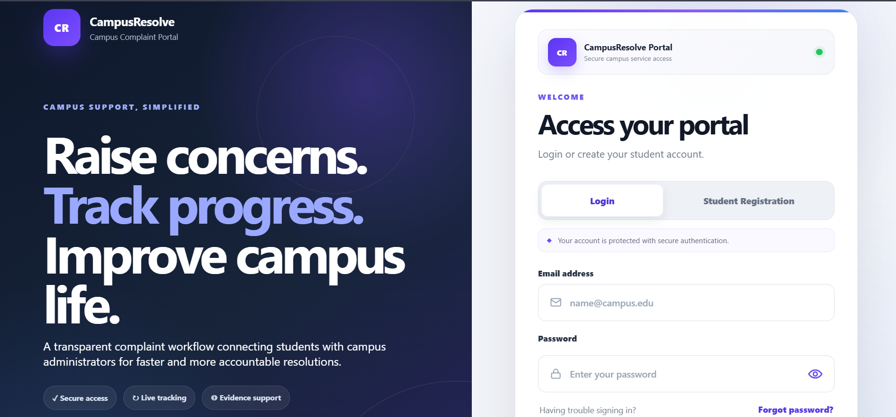
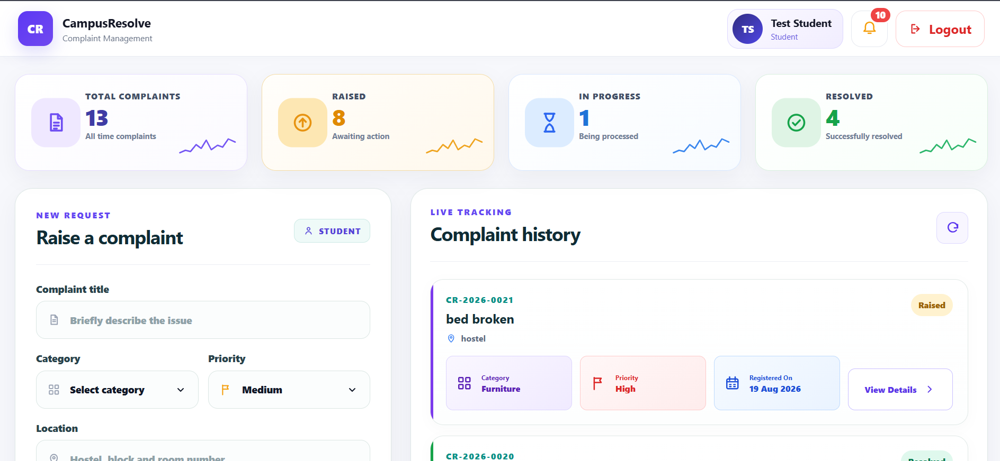
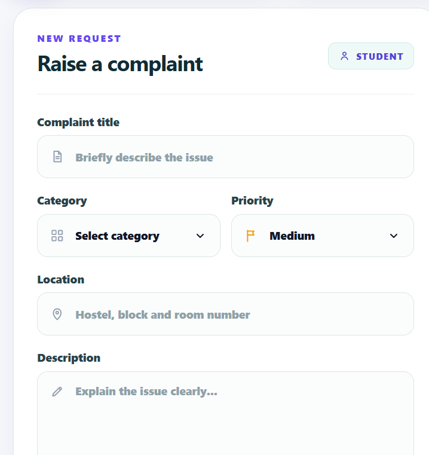
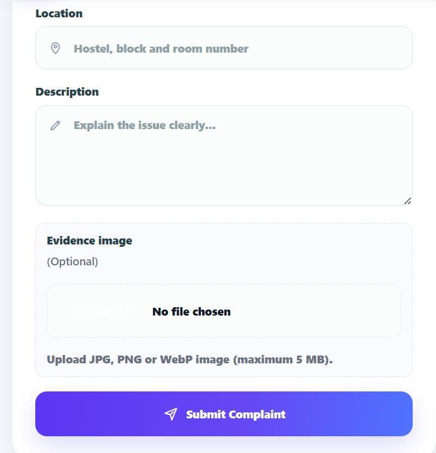
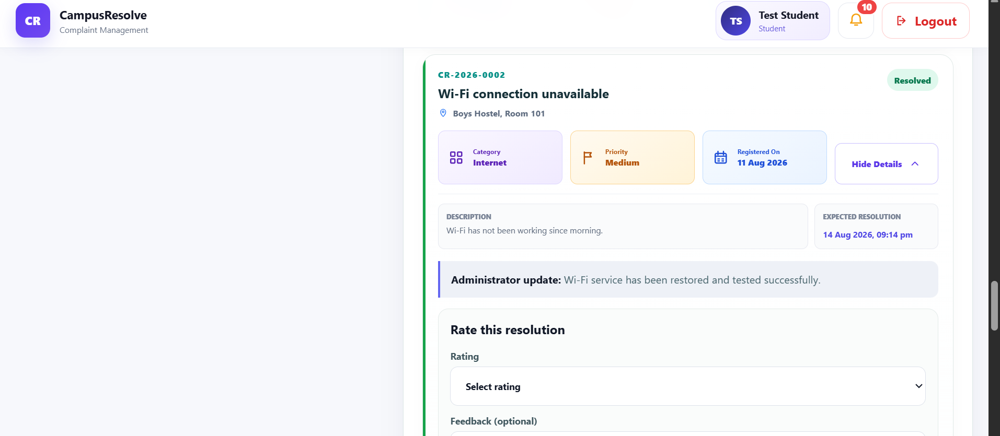
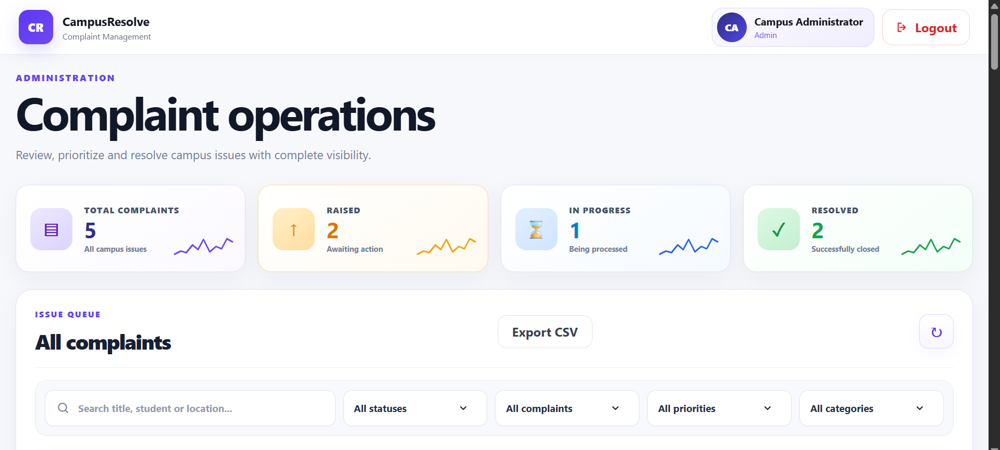
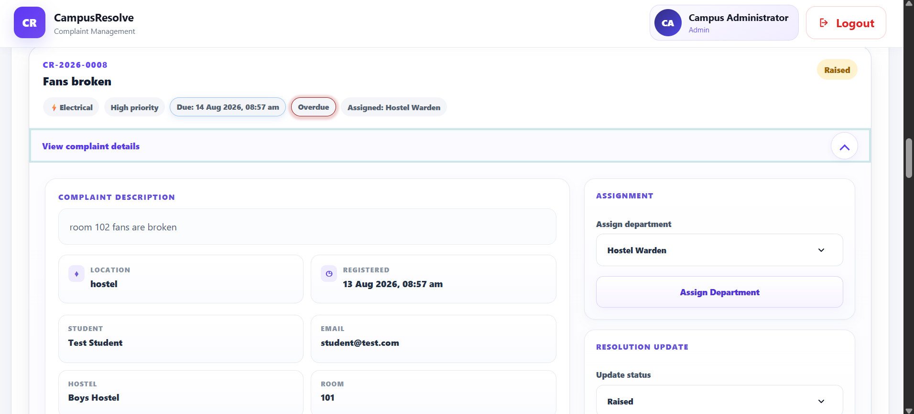
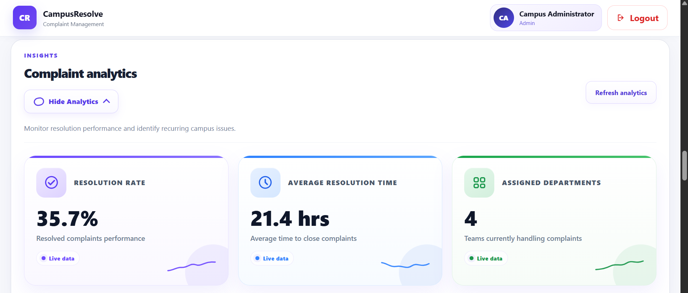
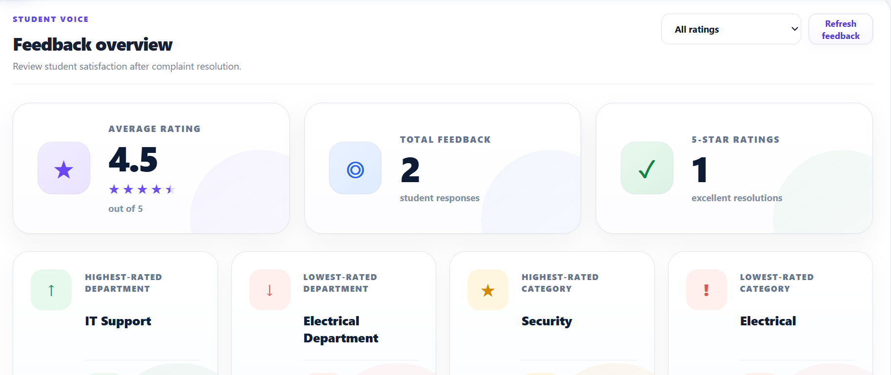
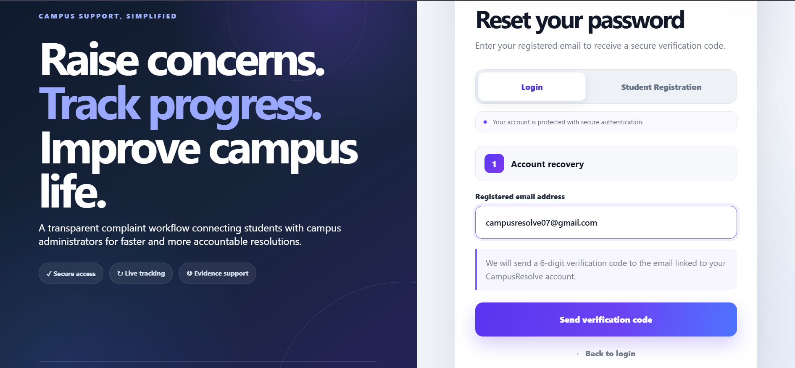

# CampusResolve

> A secure, full-stack campus complaint management system for students and administrators.

CampusResolve helps students raise and track campus issues while giving administrators a structured workflow to review, assign, update, monitor, and analyze complaints.

<p align="center">
  
</p>

## Overview

Campus complaint handling often becomes difficult when requests are scattered across messages, registers, or informal channels. CampusResolve brings the complete workflow into one place with role-based access, complaint tracking, evidence uploads, notifications, analytics, feedback, and secure account recovery.

### Highlights

- Student and Admin role-based dashboards
- Complaint creation, editing, deletion, tracking, and history
- Evidence image uploads
- Department assignment and reassignment
- Status updates and administrator notes
- Due dates, overdue tracking, and escalation indicators
- Notifications
- Complaint analytics and feedback insights
- OTP-based password recovery
- Security-focused API and upload validation

---

## Screenshots

### Student Dashboard

<p align="center">
  
</p>

### Raise a Complaint

<p align="center">
  
  
</p>

### Complaint Details

<p align="center">
  
</p>

### Admin Dashboard

<p align="center">
  
</p>

### Complaint Management

<p align="center">
  
</p>

### Analytics

<p align="center">
  
</p>

### Feedback Overview

<p align="center">
  
</p>

### Password Recovery

<p align="center">
  
</p>

---

## Core Features

### Student Portal

- Secure registration and login
- Raise complaints with:
  - Title
  - Category
  - Priority
  - Location
  - Description
  - Optional evidence image
- View personal complaint history
- Track complaint status and expected resolution
- Edit or delete eligible complaints
- View administrator updates
- Receive notifications
- Submit ratings and feedback after resolution
- Recover account using OTP-based password reset

### Admin Portal

- Dedicated administration dashboard
- View all complaints in a centralized queue
- Search and filter complaints by multiple criteria
- Assign or reassign complaints to departments
- Update complaint status
- Add administrator notes
- Track due dates, overdue complaints, and escalation levels
- View complaint activity history
- Export complaint data
- View complaint analytics
- Review student feedback and satisfaction insights

---

## Tech Stack

| Layer | Technology |
|---|---|
| Frontend | HTML5, CSS3, JavaScript |
| Backend | Node.js, Express.js |
| Database | MySQL |
| Authentication | JWT |
| Password Security | bcrypt |
| Validation | express-validator |
| Security Headers | Helmet |
| Rate Limiting | express-rate-limit |
| File Uploads | Multer |
| Email / OTP | Resend API |
| Database Driver | mysql2 |

---

## Security

CampusResolve includes multiple security-focused measures:

- Password hashing with bcrypt
- JWT-based authentication
- Role-based authorization
- Request payload validation
- API rate limiting
- Helmet security headers
- Configurable CORS policy
- Restricted evidence upload types and sizes
- Safer generated upload filenames
- Protected upload serving
- OTP expiration and attempt limits
- Environment-variable based secret management
- Hidden `.env` through `.gitignore`

> Never commit `.env`, API keys, database passwords, JWT secrets, or admin credentials to the repository.

---

## Complaint Workflow

```text
Student raises complaint
        ↓
Complaint enters admin queue
        ↓
Admin reviews and assigns department
        ↓
Status updated to In Progress
        ↓
Administrator adds resolution updates
        ↓
Complaint marked Resolved
        ↓
Student submits rating / feedback
```

---

## Project Structure

```text
campus-complaint-system/
├── config/
├── controllers/
├── middleware/
├── public/
│   ├── css/
│   ├── js/
│   └── uploads/
├── routes/
├── screenshots/
├── utils/
├── server.js
├── package.json
├── package-lock.json
└── README.md
```

---

## Getting Started

### 1. Clone the repository

```bash
git clone https://github.com/Ashutosh9-pan/campus-complaint-system.git
cd campus-complaint-system
```

### 2. Install dependencies

```bash
npm install
```

### 3. Configure environment variables

Create a `.env` file in the project root:

```env
PORT=5000
NODE_ENV=development

DB_HOST=localhost
DB_USER=your_database_user
DB_PASSWORD=your_database_password
DB_NAME=campus_complaint_system

JWT_SECRET=your_secure_jwt_secret

ADMIN_NAME=Campus Administrator
ADMIN_EMAIL=your_admin_email
ADMIN_PASSWORD=your_admin_password

RESEND_API_KEY=your_resend_api_key
```

### 4. Prepare the MySQL database

Create the required MySQL database and tables using the project schema before starting the server.

### 5. Start the application

```bash
npm start
```

Open:

```text
http://localhost:5000
```

---

## API Areas

The backend is organized around:

```text
/api/auth
/api/complaints
/api/notifications
/api/health
```

Authentication and role permissions are enforced on protected routes.

---

## Email Testing Note

The current Resend testing configuration can send test emails only to the email address authorized by the Resend account.

For production email delivery to other users, a verified custom domain should be configured in Resend and used as the sender domain.

---

## Future Improvements

- Production hosting
- Managed cloud MySQL database
- Verified custom email domain
- Department-specific administrator accounts
- Real-time notifications
- Advanced reporting and downloadable reports
- Mobile application
- Additional audit and monitoring tools

---

## Repository

**GitHub:**  
https://github.com/Ashutosh9-pan/campus-complaint-system

---

## Author

**Ashutosh Panwar**

GitHub: https://github.com/Ashutosh9-pan

---

<p align="center">
  Built as a practical full-stack project focused on secure complaint tracking, administration, and campus issue resolution.
</p>
